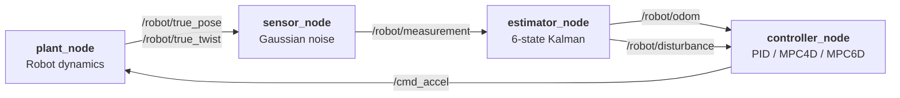

# Robot Control Sim

[](https://github.com/florianpfleiderer/robot_control_sim/actions/workflows/ci.yml)
[](https://en.cppreference.com/w/cpp/17)
[](https://docs.ros.org/en/jazzy/)
[](#license)

A 2D robot control simulator written in modern C++. PID, MPC (4-state and 6-state with disturbance), and a Kalman filter — all expressed as a clean math library, then wrapped as a ROS 2 Jazzy package whose nodes can be launched with one command via Docker.

## Architecture



## Quick start

### Docker (recommended — no native ROS install needed)

```bash
make image    # build the robot_control_sim:jazzy image
make ws       # colcon build inside the container
make launch   # full stack with RViz (X11 forwarded)
make test     # launch_testing smoke test
```

### Standalone math library + executable

```bash
cmake -S . -B build
cmake --build build
ctest --test-dir build      # run unit tests
./build/bin/robot_sim       # run the standalone simulator -> trajectory_data.csv
python3 plot_results.py     # visualise
```

## ROS 2 topics & frames

| Topic                | Type                           | Direction          |
|----------------------|--------------------------------|--------------------|
| `/robot/true_pose`   | `geometry_msgs/PoseStamped`    | plant → *          |
| `/robot/true_twist`  | `geometry_msgs/TwistStamped`   | plant → *          |
| `/robot/measurement` | `geometry_msgs/PointStamped`   | sensor → estimator |
| `/robot/odom`        | `nav_msgs/Odometry`            | estimator → ctrl   |
| `/robot/disturbance` | `geometry_msgs/Vector3Stamped` | estimator → ctrl   |
| `/cmd_accel`         | `geometry_msgs/AccelStamped`   | controller → plant |

Frames: `map → odom → base_link` (static `map → odom`, dynamic `odom → base_link` broadcast by the estimator).

## Controllers

| Controller | State              | Notes                                                                 |
|------------|--------------------|------------------------------------------------------------------------|
| `pid`      | none               | Classic P-I-D with leak-free integrator and filtered derivative.       |
| `mpc4d`    | `[x ẋ y ẏ]`         | LQ receding-horizon over a 4D double integrator.                       |
| `mpc6d`    | `[x ẋ y ẏ dx dy]`   | 4D + constant-force disturbance state estimated by the KF and fed in via `/robot/disturbance`. |

Switch at runtime:

```bash
ros2 param set /controller_node controller_type pid     # or mpc4d / mpc6d
```

## Project layout

```
.
├── app/main.cpp                      # standalone driver
├── include/                          # public headers (robot, pid, mpc, kalman, sensor)
├── src/                              # math library sources -> robot_sim_lib
├── tests/                            # GoogleTest unit tests
├── ros2_ws/src/robot_control_sim_ros2/
│   ├── src/                          # plant / sensor / estimator / controller nodes
│   ├── launch/                       # robot_sim.launch.py
│   ├── config/params.yaml            # node parameters
│   ├── urdf/robot.urdf.xacro         # minimal puck visual
│   ├── rviz/robot_sim.rviz           # RViz panels
│   └── test/test_launch.py           # launch_testing smoke test
├── docker/                           # Dockerfile, compose.yaml, entrypoint.sh
├── Makefile                          # docker compose wrappers
├── plot_results.py                   # matplotlib visualiser for trajectory_data.csv
└── .github/workflows/ci.yml          # CI pipeline
```

## Testing

The standalone math library is covered by GoogleTest unit tests (`tests/`). The ROS 2 package has a `launch_testing` smoke test that asserts all four nodes come up.

```bash
# C++ math library
cmake --build build && ctest --test-dir build --output-on-failure

# ROS 2 package (inside the Docker env)
make test
```

Both are run on every push and PR by the [CI workflow](.github/workflows/ci.yml).

## Roadmap

- [x] **v1** — ROS 2 Jazzy package wrapping `robot_sim_lib`.
- [x] **v2** — Docker environment + Makefile + verified colcon build.
- [x] **v3** — `/robot/disturbance` topic closing the MPC6D loop + launch_testing.
- [x] **CI + unit tests + polished README.**
- [ ] `ros2_control` plugin wrapper for the MPC.
- [ ] Nav2 `Controller` plugin.
- [ ] `pybind` wrapper for the math library.

## License

MIT.
