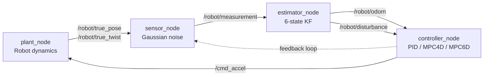

# CI Pipeline, Unit Tests, and Polished README Implementation Plan

> **For agentic workers:** REQUIRED SUB-SKILL: Use superpowers:subagent-driven-development (recommended) or superpowers:executing-plans to implement this plan task-by-task. Steps use checkbox (`- [ ]`) syntax for tracking.

**Goal:** Make the repo look like a polished, professional ROS 2 / C++ project: a GitHub Actions CI workflow that runs unit tests for the math library and the ROS 2 package, plus a rewritten root README with status badges, a Mermaid architecture diagram, and clean quick-start sections.

**Architecture:**
- **GoogleTest** is FetchContent-pulled by the root `CMakeLists.txt`; tests live under `tests/` and are registered with `gtest_discover_tests` so `ctest --test-dir build` runs them. Initial scope: representative tests for `Robot`, `PID`, and `KalmanFilter` (each ~30–60 lines). `Sensor` is stochastic and `MPC` setup is verbose, so both are deferred unless they fit easily.
- **CI workflow** `.github/workflows/ci.yml` runs two parallel jobs on `ubuntu-24.04`:
  1. `standalone` — apt cmake/g++, configure + build + ctest at repo root.
  2. `ros2` — `ros-tooling/setup-ros@v0.7` installs Jazzy, then `colcon build` and `colcon test` inside `ros2_ws/`.
  Triggers: `push` and `pull_request`. Badge URL goes in the README.
- **README rewrite** keeps the existing technical content but reorganises around badges + architecture + quick-start, with a Mermaid topic-flow diagram.

**Tech Stack:** GoogleTest 1.15.2 (FetchContent), GitHub Actions, `ros-tooling/setup-ros@v0.7`, ROS 2 Jazzy on Noble runners.

**Constraint:** Every commit keeps `cmake --build build` and `make ws` green. CI itself can only be validated post-merge (the badge becomes live once the workflow runs on `main`), so the PR description will flag any first-merge tweaks if the workflow needs them.

---

## File Structure

**New:**
- `tests/CMakeLists.txt` — registers the GoogleTest executable.
- `tests/test_robot.cpp` — kinematics integration test.
- `tests/test_pid.cpp` — PID step response test.
- `tests/test_kalman.cpp` — KF convergence under noiseless measurements.
- `.github/workflows/ci.yml` — two-job CI pipeline.
- `docs/superpowers/plans/2026-05-14-ci-tests-readme.md` — this plan.

**Modify:**
- `CMakeLists.txt` (root) — add GoogleTest via FetchContent, `enable_testing()`, `add_subdirectory(tests)`.
- `README.md` (root) — full rewrite around badges + Mermaid diagram + sections.
- `.gitignore` — no change expected; existing rules cover gtest build artifacts.

---

## Task 1: Add GoogleTest FetchContent + tests subdirectory shell

**Files:**
- Modify: `CMakeLists.txt`
- Create: `tests/CMakeLists.txt`

- [ ] **Step 1: Append GoogleTest block to root `CMakeLists.txt`** (after the existing Eigen FetchContent block, before `add_library(robot_sim_lib ...)`):

```cmake
# --- Fetch GoogleTest -------------------------------------------------------

include(FetchContent)
FetchContent_Declare(
    googletest
    GIT_REPOSITORY https://github.com/google/googletest.git
    GIT_TAG v1.15.2
)
# Prevent override of parent project's compiler/linker settings on Windows.
set(gtest_force_shared_crt ON CACHE BOOL "" FORCE)
FetchContent_MakeAvailable(googletest)
```

- [ ] **Step 2: Append `enable_testing` and `add_subdirectory(tests)` at the bottom of root `CMakeLists.txt`**:

```cmake
# --- Tests ------------------------------------------------------------------

enable_testing()
add_subdirectory(tests)
```

- [ ] **Step 3: Create `tests/CMakeLists.txt` with an empty test target placeholder** (real test sources land in subsequent tasks):

```cmake
include(GoogleTest)

add_executable(robot_sim_tests)

target_link_libraries(robot_sim_tests
    PRIVATE robot_sim_lib GTest::gtest_main
)

# Test sources are added by include() of per-test fragments in subsequent tasks.
target_sources(robot_sim_tests PRIVATE
    test_robot.cpp
    test_pid.cpp
    test_kalman.cpp
)

gtest_discover_tests(robot_sim_tests)
```

> **Note:** This commit will fail to build until at least one of the listed `.cpp` files exists. That's fine — combine Task 1 + Task 2 into a single commit if you want a buildable mid-state, or accept one transient broken commit. The plan favours atomic commits, so Tasks 1+2 are merged into one commit at the end of Task 2.

---

## Task 2: First test — `tests/test_robot.cpp`

**Files:** Create `tests/test_robot.cpp`.

- [ ] **Step 1: Write `tests/test_robot.cpp`**

```cpp
#include "robot.h"

#include <gtest/gtest.h>

TEST(Robot, ConstructsAtOrigin) {
  Robot r;
  const auto [x, y]   = r.position();
  const auto [vx, vy] = r.velocity();
  EXPECT_DOUBLE_EQ(x, 0.0);
  EXPECT_DOUBLE_EQ(y, 0.0);
  EXPECT_DOUBLE_EQ(vx, 0.0);
  EXPECT_DOUBLE_EQ(vy, 0.0);
}

TEST(Robot, AccelerationMovesPositionForward) {
  Robot r;
  for (int i = 0; i < 10; ++i) {
    r.update(1.0, 0.0, 0.05);
  }
  const auto [x, y] = r.position();
  EXPECT_GT(x, 0.0);
  EXPECT_DOUBLE_EQ(y, 0.0);
}

TEST(Robot, ZeroCommandDoesNotIntroduceMotion) {
  Robot r;
  r.update(0.0, 0.0, 0.05);
  const auto [vx, vy] = r.velocity();
  EXPECT_DOUBLE_EQ(vx, 0.0);
  EXPECT_DOUBLE_EQ(vy, 0.0);
}
```

- [ ] **Step 2: Verify build + ctest pass**

```bash
cmake -S . -B build && cmake --build build && ctest --test-dir build --output-on-failure
```
Expected: 3 tests pass.

- [ ] **Step 3: Commit** (bundles Tasks 1 + 2 to avoid a broken intermediate state)

```bash
git add CMakeLists.txt tests/CMakeLists.txt tests/test_robot.cpp
git commit -m "test: add GoogleTest infrastructure and Robot kinematics tests"
```

---

## Task 3: `tests/test_pid.cpp`

**Files:** Create `tests/test_pid.cpp`.

- [ ] **Step 1: Write the test**

```cpp
#include "pid.h"

#include <gtest/gtest.h>

TEST(PID, StepCommandPullsTowardTarget) {
  PID  pid {1.0, 0.0, 0.0};
  auto out = pid.compute(/*target_x=*/1.0, /*target_y=*/0.0,
                         /*current_x=*/0.0, /*current_y=*/0.0, /*dt=*/0.05);
  EXPECT_GT(out.x, 0.0);
  EXPECT_DOUBLE_EQ(out.y, 0.0);
}

TEST(PID, ZeroErrorYieldsZeroProportional) {
  PID  pid {1.0, 0.0, 0.0};
  auto out = pid.compute(0.0, 0.0, 0.0, 0.0, 0.05);
  EXPECT_DOUBLE_EQ(out.x, 0.0);
  EXPECT_DOUBLE_EQ(out.y, 0.0);
}

TEST(PID, IntegralAccumulatesOverRepeatedError) {
  PID  pid {0.0, 1.0, 0.0};
  auto first  = pid.compute(1.0, 0.0, 0.0, 0.0, 0.05);
  auto second = pid.compute(1.0, 0.0, 0.0, 0.0, 0.05);
  // After two steps with kp=0, kd=0, only the integral term remains and it must grow.
  EXPECT_GT(second.x, first.x);
}
```

- [ ] **Step 2: Verify**

```bash
cmake --build build && ctest --test-dir build --output-on-failure
```
Expected: 6 tests pass (3 from Task 2 + 3 from Task 3).

- [ ] **Step 3: Commit**

```bash
git add tests/test_pid.cpp
git commit -m "test: add PID step/zero-error/integral tests"
```

---

## Task 4: `tests/test_kalman.cpp`

**Files:** Create `tests/test_kalman.cpp`.

- [ ] **Step 1: Write the test**

```cpp
#include "kalman.h"

#include <Eigen/Dense>
#include <gtest/gtest.h>

namespace {

PositionVelocityKF1D make_constant_velocity_kf(double dt) {
  Eigen::Matrix<double, 2, 1> x0;
  x0 << 0.0, 0.0;
  Eigen::Matrix2d P0 = Eigen::Matrix2d::Identity() * 1.0;

  PositionVelocityKF1D kf {x0, P0};

  Eigen::Matrix2d A;
  A << 1.0, dt,
       0.0, 1.0;
  Eigen::Matrix<double, 2, 1> B;
  B << 0.5 * dt * dt, dt;
  Eigen::Matrix<double, 1, 2> H;
  H << 1.0, 0.0;
  Eigen::Matrix2d Q = Eigen::Matrix2d::Identity() * 1e-4;
  Eigen::Matrix<double, 1, 1> R;
  R << 1e-2;

  kf.setStateTransitionMatrix(A);
  kf.setControlMatrix(B);
  kf.setMeasurementMatrix(H);
  kf.setProcessNoiseCovariance(Q);
  kf.setMeasurementNoiseCovariance(R);
  return kf;
}

}  // namespace

TEST(KalmanFilter, PredictWithZeroControlLeavesZeroStateUnchanged) {
  auto kf = make_constant_velocity_kf(0.05);
  Eigen::Matrix<double, 1, 1> u;
  u << 0.0;
  kf.predict(u);
  const auto &x = kf.state();
  EXPECT_DOUBLE_EQ(x(0), 0.0);
  EXPECT_DOUBLE_EQ(x(1), 0.0);
}

TEST(KalmanFilter, ConvergesToConsistentMeasurement) {
  auto kf = make_constant_velocity_kf(0.05);
  Eigen::Matrix<double, 1, 1> u;
  u << 0.0;
  Eigen::Matrix<double, 1, 1> z;
  z << 5.0;
  for (int i = 0; i < 200; ++i) {
    kf.predict(u);
    kf.update(z);
  }
  EXPECT_NEAR(kf.state()(0), 5.0, 0.1);
}
```

- [ ] **Step 2: Verify**

```bash
cmake --build build && ctest --test-dir build --output-on-failure
```
Expected: 8 tests pass.

- [ ] **Step 3: Commit**

```bash
git add tests/test_kalman.cpp
git commit -m "test: add KalmanFilter predict/converge tests"
```

---

## Task 5: GitHub Actions CI workflow

**Files:** Create `.github/workflows/ci.yml`.

Two parallel jobs:
- `standalone` — apt-installs the toolchain, configures with CMake, builds, runs ctest.
- `ros2` — uses `ros-tooling/setup-ros@v0.7` to install ROS 2 Jazzy on Noble, sources, runs `colcon build` and `colcon test` inside `ros2_ws/`.

- [ ] **Step 1: Write the workflow**

```yaml
name: CI

on:
  push:
    branches: [main]
  pull_request:

concurrency:
  group: ${{ github.workflow }}-${{ github.ref }}
  cancel-in-progress: true

jobs:
  standalone:
    name: Standalone (C++ + GoogleTest)
    runs-on: ubuntu-24.04
    steps:
      - uses: actions/checkout@v4

      - name: Install build tools
        run: |
          sudo apt-get update
          sudo apt-get install -y --no-install-recommends \
            build-essential cmake ninja-build

      - name: Configure
        run: cmake -S . -B build -G Ninja -DCMAKE_BUILD_TYPE=Release

      - name: Build
        run: cmake --build build

      - name: Test
        run: ctest --test-dir build --output-on-failure

  ros2:
    name: ROS 2 Jazzy (colcon build + launch_testing)
    runs-on: ubuntu-24.04
    steps:
      - uses: actions/checkout@v4

      - uses: ros-tooling/setup-ros@v0.7
        with:
          required-ros-distributions: jazzy

      - name: Install package deps
        run: |
          sudo apt-get update
          sudo apt-get install -y --no-install-recommends \
            ros-jazzy-xacro \
            ros-jazzy-tf2-ros \
            ros-jazzy-tf2-geometry-msgs \
            ros-jazzy-launch-testing-ament-cmake \
            ros-jazzy-launch-testing

      - name: colcon build
        shell: bash
        run: |
          source /opt/ros/jazzy/setup.bash
          cd ros2_ws
          colcon build --symlink-install --event-handlers console_cohesion+

      - name: colcon test
        shell: bash
        run: |
          source /opt/ros/jazzy/setup.bash
          source ros2_ws/install/setup.bash
          cd ros2_ws
          colcon test --event-handlers console_direct+
          colcon test-result --verbose
```

- [ ] **Step 2: Lint locally with `actionlint` if available**

```bash
command -v actionlint && actionlint .github/workflows/ci.yml || echo "actionlint not installed — skipping"
```

- [ ] **Step 3: Commit**

```bash
git add .github/workflows/ci.yml
git commit -m "ci: add GitHub Actions workflow for standalone build and ROS 2"
```

---

## Task 6: Polished README rewrite

**Files:** Modify `README.md` (root).

Sections (in order):
1. Title + tagline.
2. Badge row: CI status, license, C++17, ROS distro.
3. One-paragraph project summary.
4. Mermaid topic-flow diagram.
5. Quick start — Docker (recommended) and standalone.
6. Architecture (topics + frames table).
7. Project layout.
8. Roadmap.
9. License.

- [ ] **Step 1: Replace `README.md` contents**

```markdown
# Robot Control Sim

[](https://github.com/florianpfleiderer/robot_control_sim/actions/workflows/ci.yml)
[](https://en.cppreference.com/w/cpp/17)
[](https://docs.ros.org/en/jazzy/)
[](#license)

A 2D robot control simulator written in modern C++. PID, MPC (4-state and 6-state with disturbance), and a Kalman filter all expressed as a clean math library, then wrapped as a ROS 2 Jazzy package whose nodes can be launched with one command via Docker.

## Architecture



## Quick start

### Docker (recommended — no native ROS install needed)

```bash
make image    # build the robot_control_sim:jazzy image
make ws       # colcon build inside the container
make launch   # full stack with RViz (X11 forwarded)
make test     # launch_testing smoke test
```

### Standalone math library + executable

```bash
cmake -S . -B build
cmake --build build
ctest --test-dir build      # run unit tests
./build/bin/robot_sim       # run the standalone simulator -> trajectory_data.csv
python3 plot_results.py     # visualise
```

## ROS 2 topics & frames

| Topic                | Type                           | Direction          |
|----------------------|--------------------------------|--------------------|
| `/robot/true_pose`   | `geometry_msgs/PoseStamped`    | plant → *          |
| `/robot/true_twist`  | `geometry_msgs/TwistStamped`   | plant → *          |
| `/robot/measurement` | `geometry_msgs/PointStamped`   | sensor → estimator |
| `/robot/odom`        | `nav_msgs/Odometry`            | estimator → ctrl   |
| `/robot/disturbance` | `geometry_msgs/Vector3Stamped` | estimator → ctrl   |
| `/cmd_accel`         | `geometry_msgs/AccelStamped`   | controller → plant |

Frames: `map → odom → base_link` (static `map→odom`, dynamic `odom→base_link` broadcast by the estimator).

## Project layout

```
.
├── app/main.cpp                      # standalone driver
├── include/                          # public headers (robot, pid, mpc, kalman, sensor)
├── src/                              # math library sources -> robot_sim_lib
├── tests/                            # GoogleTest unit tests
├── ros2_ws/src/robot_control_sim_ros2/
│   ├── src/                          # plant / sensor / estimator / controller nodes
│   ├── launch/                       # robot_sim.launch.py
│   ├── config/params.yaml            # node parameters
│   ├── urdf/robot.urdf.xacro         # minimal puck visual
│   ├── rviz/robot_sim.rviz           # RViz panels
│   └── test/test_launch.py           # launch_testing smoke test
├── docker/                           # Dockerfile, compose.yaml, entrypoint.sh
├── Makefile                          # docker compose wrappers
└── plot_results.py                   # matplotlib visualiser for trajectory_data.csv
```

## Controllers

| Controller | State          | Notes                                                                 |
|------------|----------------|------------------------------------------------------------------------|
| `pid`      | none           | classic P-I-D with leak-free integrator and filtered derivative.       |
| `mpc4d`    | `[x ẋ y ẏ]`     | LQ receding horizon over a 4D double integrator.                       |
| `mpc6d`    | `[x ẋ y ẏ dx dy]` | 4D + constant-force disturbance state estimated by the KF and fed in via `/robot/disturbance`. |

Switch at runtime: `ros2 param set /controller_node controller_type {pid,mpc4d,mpc6d}`.

## Roadmap

- [x] v1 — ROS 2 Jazzy package wrapping `robot_sim_lib`.
- [x] v2 — Docker environment + Makefile + verified colcon build.
- [x] v3 — `/robot/disturbance` topic closing the MPC6D estimator/controller loop + launch_testing smoke test.
- [x] CI + unit tests + polished README.
- [ ] ros2_control plugin wrapper for the MPC.
- [ ] Nav2 `Controller` plugin.
- [ ] `pybind` wrapper for the math library.

## License

MIT — see source headers.
```

- [ ] **Step 2: Commit**

```bash
git add README.md
git commit -m "docs: rewrite README with badges, Mermaid diagram, and quick-start sections"
```

---

## Task 7: Open the PR

The CI workflow will fire automatically on the PR and the badge becomes meaningful once it lands on `main`.

- [ ] **Step 1: Push**

```bash
git push -u origin feat/ci-tests-and-readme
```

- [ ] **Step 2: Open the PR**

```bash
gh pr create --title "feat: CI pipeline, GoogleTest unit tests, polished README" --body "..."
```

(Body in the execution script — summarises the additions and notes that the CI badge becomes live once this merges.)

---

## Self-Review

**Spec coverage:**
- "CI pipeline" → Task 5 (`.github/workflows/ci.yml`).
- "tests etc" → Tasks 1–4 (GoogleTest infra + Robot/PID/KF tests).
- "good README" → Task 6 (badges, Mermaid, sections).
- "new feature branch, PR" → Task 7.
- "so the pipeline can be tested after the merge" → workflow runs on both `pull_request` and `push: main`; the PR itself will trigger CI on the branch, and the badge URL points at the main-branch workflow status.

**Placeholder scan:** Every code block in this plan is complete. The PR body template in Task 7 has `...` but I'll fill it in concretely during execution.

**Type consistency:**
- `Robot::position()` / `velocity()` return `std::pair<double, double>` — matches `include/robot.h`.
- `PID::compute(...)` returns `Coordinate<double>` with `.x` / `.y` members — matches `include/coordinate.h`.
- `PositionVelocityKF1D` is `KalmanFilter<double, 2, 1, 1>` — state vector 2x1, control 1x1, measurement 1x1, matches `include/kalman.h:227`.
- `gtest_discover_tests` is the standard CMake/GTest integration; requires `include(GoogleTest)` once, then per-target. Plan places it in `tests/CMakeLists.txt` at file top.

**CI-specific risk:**
- ROS 2 Jazzy targets Ubuntu Noble (24.04). Pinned to `ubuntu-24.04`. If the runner image's apt cache lacks a package, `ros-tooling/setup-ros@v0.7` should pull the official ROS 2 apt repo and resolve it.
- `ros-jazzy-launch-testing-ament-cmake` may also be installed by `ros-tooling/setup-ros` automatically — the explicit apt install is defensive.
- First-run flake: if any CI quirk appears (e.g. missing transitive dep), the PR description will note that a follow-up `fix(ci): ...` commit may be needed before merge.

## Execution

Proceeding inline per "work without stopping" directive.
